# Tomato Disease Detection

This project uses deep learning to detect tomato leaf diseases from images and suggest suitable agricultural interventions.

## 🪟 Windows Users - Start Here!

**Running this on Windows?** We've got you covered with two guides:

### Quick Start (5 minutes)
👉 **[WINDOWS_QUICKSTART.md](WINDOWS_QUICKSTART.md)** - Just the commands, get running fast!

### Complete Setup Guide
👉 **[WINDOWS_SETUP.md](WINDOWS_SETUP.md)** - Detailed step-by-step instructions with explanations

**What's covered:**
- ✅ Python installation and PATH configuration
- ✅ Virtual environment setup and activation
- ✅ Database migrations and superuser creation
- ✅ Static files collection
- ✅ Running the Django development server
- ✅ Troubleshooting common Windows issues
- ✅ Production deployment options for Windows

**📚 See all Windows documentation:** [WINDOWS_INDEX.md](WINDOWS_INDEX.md)

---
## Project Structure
The CAPSTONE project is organized into folders and files that separate the application code, datasets, models, notebooks, reports, and environment configurations. Below is a high-level overview of the project structure:

### CAPSTONE/
##### - app/ 
- Application code & web interface (handles uploads, predictions, and user feedback)
  - app.py
  - feedback.csv
  - feedback_data.csv
  - feedback_images/
  - static/
  - templates/
  - uploads/
##### - data/ 
  - interventions/
  - preprocessed/
  - feedback.csv

##### - models/
  - best_mobilenet_finetuned.keras
  - best_mobilenet_transfer.keras
  - best_model.keras
│
##### - notebooks/  
- Jupyter notebooks documenting experiments & workflows with saved models during training
  - tomato_disease_detection_full_workflow.ipynb
  - best_balanced_model.keras
  - additional model checkpoints
│
##### - ReadMe_files/
  - learning curves, metrics plots
  - prediction examples
│
##### - Reports/ 
  - TOMATO DISEASE DETECTION-Report.pdf
- venv/                    
  ###### Local development environment
- venv-deploy/             
  ###### Deployment environment for the app
- .devcontainer/           
  ###### VS Code dev container configuration
- .gitignore               
  ###### Git ignore file
- README.md                
  ######  Project overview and instructions
- requirements.txt         
  ######  Project deploymentdependencies
- requirements-local.txt   
  ######  Additional dependencies for local dev
- tomato_app_qr.png        
  ######  QR code for accessing the app

# 1 Business Understanding 
## 1.1 Business Overview
Tomatoes (Solanum lycopersicum L) are among the world’s most important crops in terms of production, consumption, and trade. Belonging to the Solanaceae family and originating from Central and South America (Bai & Lindhout, 2007), tomatoes play a vital role in both food security and the economy. In Sub-Saharan Africa (SSA), the crop serves as a key food and cash crop, contributing significantly to nutrition, employment, and household income (FAOSTAT, 2017).

Kenya is among the leading tomato producers in SSA, with an estimated annual production of 599,458 tonnes. The crop accounts for about 7% of total horticultural output and 14% of vegetable production nationwide (Mwangi et al., 2015). Despite its importance, tomato farming faces persistent threats from diseases such as early blight, late blight, bacterial spot, and viral infections. Early and late blight (Phytophthora infestans) together account for approximately 95.8% of pre-harvest yield losses, while bacterial wilt can cause up to 100% crop loss under severe conditions (Waiganjo et al., 2006; Kamuyu, 2017).

Traditional disease diagnosis in the field relies heavily on manual inspection by farmers or agricultural experts. However, this process is often time-consuming, subjective, and prone to delays, leading to extensive crop losses. With the increasing availability of affordable smartphones and high-resolution cameras, there is now an opportunity to leverage computer vision and deep learning to automate early tomato disease detection and support farmers in timely intervention.

## 1.2 Problem Statement
Tomato farmers in Kenya and across Sub-Saharan Africa continue to suffer heavy losses due to late or inaccurate identification of plant diseases. Manual diagnosis requires expertise and time, and is not scalable to large farms. Consequently, by the time symptoms are visible or correctly identified, the infection has often spread, reducing both yield and quality.

This project aims to address this problem by developing an AI-powered tomato leaf disease detection system that can automatically identify and classify tomato leaf images into different disease categories. By providing a fast, reliable, and low-cost diagnostic solution, the model will empower farmers and agricultural officers to take early preventive actions, improving both productivity and profitability.

## 1.3 Business Objective
### 1.3.1 Main objective:
To develop a deep learning–based image classification model capable of detecting and categorizing tomato leaf diseases .

### 1.3.2 Specific objectives:
1. To preprocess and augment tomato leaf image data to improve model robustness and generalization.

2. To train a convolutional neural network (CNN) capable of distinguishing between healthy and diseased tomato leaves.

3. To evaluate model performance using metrics such as accuracy, precision, recall, and F1-score.

4. To develop a user-friendly interface ( using Streamlit application) that allows users to upload tomato leaf images and receive instant disease predictions and interventions.

5. To provide insights that support data-driven decisions in disease management, pest control, and yield protection.

## 1.4 Research Questions
1. How can image data of tomato leaves be preprocessed and augmented to ensure optimal model performance?

2. Which CNN architectures (e.g., VGG16, ResNet, MobileNet) deliver the best classification accuracy for tomato leaf disease detection?

3. How can the model’s predictions be interpreted to ensure reliability and trust for end-users (farmers and agronomists)?

4. What level of accuracy can a deep learning model achieve in classifying diseases under real-world farm conditions?

5. How can the developed system be deployed as a practical tool to support early intervention and minimize tomato yield losses?
## 1.5 Success Criteria
- Model Performance: Achieve a classification accuracy of at least 85% and an F1-score ≥ 0.85 across all disease categories.
- Usability: The model should be integrated into a simple web interface (Streamlit) that provides instant, interpretable results for uploaded images.
- Business Impact: The system should enable farmers to detect diseases early, reduce losses, and make data-informed decisions to improve yield and profitability.

The dataset used in this study is the Tomato Leaf Diseases – Bangladesh (Mendeley Data) dataset. It was collected under natural farm conditions using smartphone cameras, representing realistic lighting, angle, and background variations that farmers typically encounter.

It contains approximately 2,600 images of tomato leaves, each labeled according to its corresponding disease category. The dataset includes both healthy leaves and several disease classes such as early blight, late blight, bacterial spot, and leaf mold.

Data Link: Mendeley Data – Tomato Leaf Diseases, Bangladesh

## Goals
- Train a CNN model for tomato disease classification.
- Integrate disease predictions with intervention recommendations.
- Develop a web-based prediction tool.

# Data understanding

# 2.1 Data overview
The dataset used in this study is the Tomato Leaf Diseases – Bangladesh (Mendeley Data) dataset. It was collected under natural farm conditions using smartphone cameras, representing realistic lighting, angle, and background variations that farmers typically encounter.

Each image is composed of a single leaf and a single background, for a total of 14,531 images, each labeled according to its corresponding disease category. The dataset includes both healthy leaves and several disease classes such as early blight, late blight, bacterial spot, and leaf mold.

Data Link:[ Mendeley Data – Tomato Leaf Diseases, Bangladesh](https://data.mendeley.com/datasets/ngdgg79rzb/1)

# 2.DATA LOADING
## 2.1 Text Dataset
# Loading the interventions dataset
- Shape: (76, 4)
- Columns: ['disease', 'scientific name', 'symptoms', 'interventions']

- The interventions dataset is successfully loaded with 76 records and four columns: disease, scientific name, symptoms, and interventions. It provides key information linking each disease to its traits and control measures. Some rows contain missing values, likely from formatting issues, indicating a need for data cleaning.

    disease            67
    scientific name    59
    symptoms           39
    interventions       0
    dtype: int64
    
This shows that many rows in “disease” and “scientific name” are missing useful data.
- in disease - Many rows don’t repeat the disease name; they belong to the same disease section.
- scientific name - Some rows skip this because it’s mentioned once at the start of each section.
- Some rows describe interventions only, or the data was incomplete.
- Data cleaning is needed to rebuild complete records and ensure each disease is correctly linked to its symptoms and interventions

- Cleaned dataset shape: (17, 4)
</style>
<table border="1" class="dataframe">
  <thead>
    <tr style="text-align: right;">
      <th></th>
      <th>disease</th>
      <th>scientific name</th>
      <th>symptoms</th>
      <th>interventions</th>
    </tr>
  </thead>
  <tbody>
    <tr>
      <th>0</th>
      <td>Early blight</td>
      <td>Alternaria solani</td>
      <td>Dark brown to black concentric-ring ("target-l...</td>
      <td>Cultural control:</td>
    </tr>
    <tr>
      <th>1</th>
      <td>Early blight</td>
      <td>Type: Fungal disease</td>
      <td>Yellowing around lesions, leading to leaf drop...</td>
      <td>Remove infected plant debris and rotate with n...</td>
    </tr>
    <tr>
      <th>2</th>
      <td>Late blight</td>
      <td>Phytophthora infestans</td>
      <td>Large, irregular, water-soaked spots on leaves...</td>
      <td>Cultural control:</td>
    </tr>
    <tr>
      <th>3</th>
      <td>Late blight</td>
      <td>Type: Oomycete (fungus-like pathogen)</td>
      <td>Rapid leaf collapse and plant death in severe ...</td>
      <td>Use certified disease-free seed/transplants. A...</td>
    </tr>
    <tr>
      <th>4</th>
      <td>bacterial spot</td>
      <td>Type: Bacterial disease</td>
      <td>Leaf spots are surrounded by yellow halos and ...</td>
      <td>Use certified disease-free seed and transplant...</td>
    </tr>
    <tr>
      <th>5</th>
      <td>bacterial spot</td>
      <td>Xanthomonas campestris pv. vesicatoria (also r...</td>
      <td>Small, dark brown to black, greasy-looking spo...</td>
      <td>Cultural control:</td>
    </tr>
    <tr>
      <th>6</th>
      <td>leaf mold</td>
      <td>Passalora fulva (formerly Cladosporium fulvum)</td>
      <td>Pale green to yellow spots on upper leaf surfa...</td>
      <td>Cultural control:</td>
    </tr>
    <tr>
      <th>7</th>
      <td>leaf mold</td>
      <td>Type: Fungal disease</td>
      <td>Olive-green to grayish-purple fuzzy mold growt...</td>
      <td>Maintain low humidity and good ventilation (es...</td>
    </tr>
    <tr>
      <th>8</th>
      <td>septorial leaf spot</td>
      <td>Septoria lycopersici (fungal disease)</td>
      <td>Small, circular spots (2–3 mm) with dark brown...</td>
      <td>Cultural control: Remove and destroy infected ...</td>
    </tr>
    <tr>
      <th>9</th>
      <td>target spot</td>
      <td>Corynespora cassiicola(fungal disease)</td>
      <td>Circular or irregular brown lesions with conce...</td>
      <td>Cultural control: Avoid overhead irrigation an...</td>
    </tr>
    <tr>
      <th>10</th>
      <td>tomato mosaic virus</td>
      <td>Tomato mosaic virus (ToMV) — a Tobamovirus</td>
      <td>Light and dark green mottling ("mosaic") of le...</td>
      <td>Cultural control:</td>
    </tr>
    <tr>
      <th>11</th>
      <td>tomato mosaic virus</td>
      <td>Type: Viral disease</td>
      <td>Leaves may be distorted, fern-like, or smaller...</td>
      <td>Use certified virus-free seeds and transplants...</td>
    </tr>
    <tr>
      <th>12</th>
      <td>tomato yellow leaf curl virus(TYLCV)</td>
      <td>Tomato yellow leaf curl virus (genus Begomovir...</td>
      <td>Severe stunting of plants with small, upward-c...</td>
      <td>Cultural control:</td>
    </tr>
    <tr>
      <th>13</th>
      <td>tomato yellow leaf curl virus(TYLCV)</td>
      <td>Type: Viral disease</td>
      <td>Drastic yield losses due to poor fruit set. Sp...</td>
      <td>Remove and destroy infected plants immediately...</td>
    </tr>
    <tr>
      <th>14</th>
      <td>tomato yellow leaf curl virus(TYLCV)</td>
      <td>Vector: Whitefly (Bemisia tabaci)</td>
      <td>Reduced leaf size and interveinal chlorosis.</td>
      <td>Use virus-free seedlings.</td>
    </tr>
    <tr>
      <th>15</th>
      <td>two-spoted spider mite</td>
      <td>Tetranychus urticae</td>
      <td>Tiny yellow or white speckling on upper leaf s...</td>
      <td>Cultural control:</td>
    </tr>
    <tr>
      <th>16</th>
      <td>two-spoted spider mite</td>
      <td>Type: Mite (arthropod pest)</td>
      <td>Fine webbing on the undersides of leaves, espe...</td>
      <td>Maintain adequate irrigation and humidity to d...</td>
    </tr>
  </tbody>
</table>

# Data Cleaning Process for the Interventions Dataset
1. Data Loading and Initial Inspection
The dataset was first loaded into a pandas DataFrame and examined to understand its structure, check for missing values, and identify inconsistencies in formatting across all 4 columns.
2. Handling Missing and Irrelevant Entries
    - Rows containing empty or null entries in the disease or interventions columns were removed.
    - Duplicate records were dropped to ensure each disease-intervention pair was unique.
3. Standardizing Text Cases
    - All disease names and intervention descriptions were converted to lowercase for uniformity and ease of matching during later analysis.
4. Removing Unnecessary Symbols and Whitespace
    - Extra bullet points and multiple consecutive symbols were reduced to a single consistent format.
    - Unwanted newline spaces and leading or trailing whitespaces were removed to enhance readability.
5. Column Validation and Alignment
    - Verified that each disease correctly corresponded with its scientific name, symptom description, and intervention measures.
6. Final Review and Verification
    - The cleaned dataset was reviewed to confirm structural consistency, readable text, and logical linkage among diseases, their scientific names, symptoms, and interventions.

## 2.2 Image Dataset

# Preprocesssed Dataset
- A total of 10 classes are found.

                                  Class  Image_Count
    0                 Bacterial_spot227         1702
    1                   Early_blight227          800
    2                        healthy227         1272
    3                    Late_blight227         1528
    4                      Leaf_Mold227          762
    5             Septoria_leaf_spot227         1417
    6                    Target_Spot227         1124
    7            Tomato_mosaic_virus227          299
    8  Tomato_Yellow_Leaf_Curl_Virus227         4286
    9        Two-spotted_spider_mite227         1341
    
      sns.barplot(data=df_counts, x="Class", y="Image_Count", palette="viridis")
    
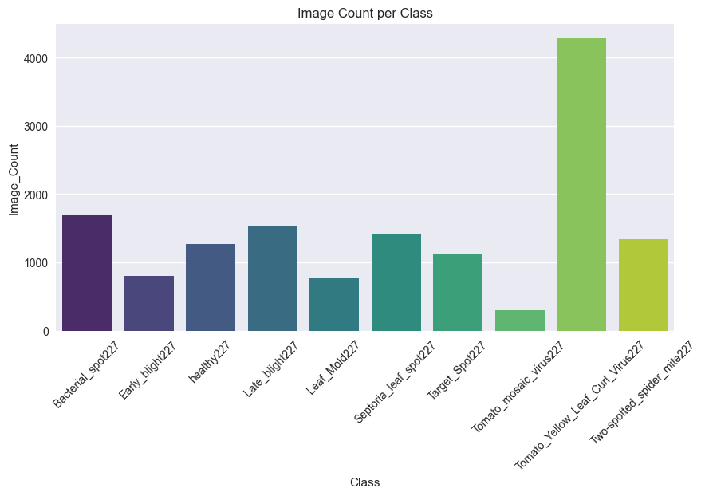

- The dataset contains 10 tomato leaf classes with varying image counts. Tomato_Yellow_Leaf_Curl_Virus227 has the most images of 4,286, while Tomato_mosaic_virus 227 has the fewest of 299, indicating class imbalance.

# 3.splitting the data
- The TensorFlow datasets were successfully created, containing 10 classes. The training set has 10,167 images, the    validation set 2,175 images, and the test set 2,189 images, maintaining the class structure from the original dataset.
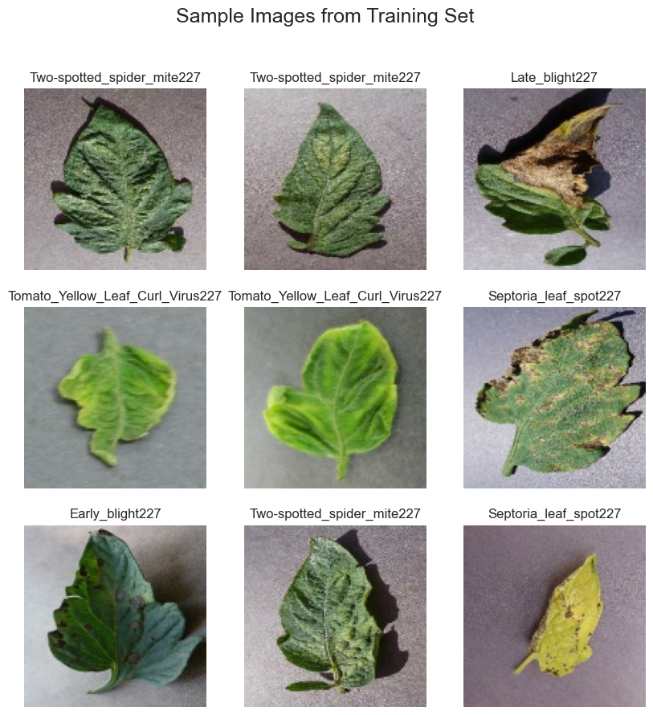

2. DATA AUGMENTATION sample    
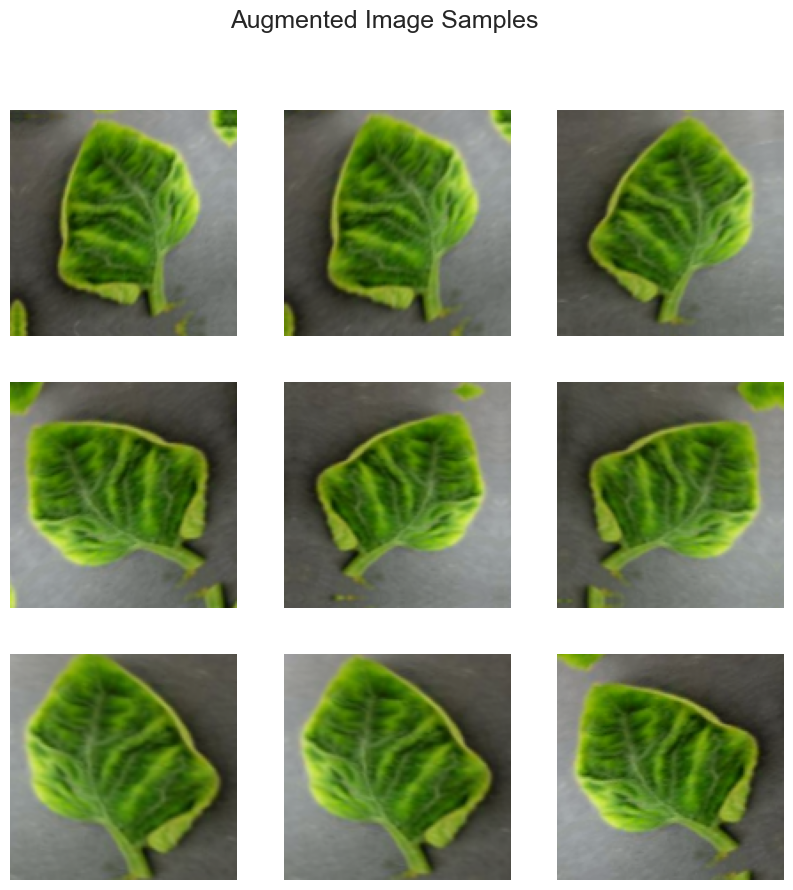
# 4.Building the baseline model
<pre style="white-space:pre;overflow-x:auto;line-height:normal;font-family:Menlo,'DejaVu Sans Mono',consolas,'Courier New',monospace">Model: "sequential_1"
</pre>
<pre style="white-space:pre;overflow-x:auto;line-height:normal;font-family:Menlo,'DejaVu Sans Mono',consolas,'Courier New',monospace">┏━━━━━━━━━━━━━━━━━━━━━━━━━━━━━━━━━┳━━━━━━━━━━━━━━━━━━━━━━━━┳━━━━━━━━━━━━━━━┓
┃ Layer (type)                    ┃ Output Shape           ┃       Param # ┃
┡━━━━━━━━━━━━━━━━━━━━━━━━━━━━━━━━━╇━━━━━━━━━━━━━━━━━━━━━━━━╇━━━━━━━━━━━━━━━┩
│ sequential (Sequential)         │ (None, 128, 128, 3)    │             0 │
├─────────────────────────────────┼────────────────────────┼───────────────┤
│ rescaling (Rescaling)           │ (None, 128, 128, 3)    │             0 │
├─────────────────────────────────┼────────────────────────┼───────────────┤
│ conv2d (Conv2D)                 │ (None, 126, 126, 32)   │           896 │
├─────────────────────────────────┼────────────────────────┼───────────────┤
│ max_pooling2d (MaxPooling2D)    │ (None, 63, 63, 32)     │             0 │
├─────────────────────────────────┼────────────────────────┼───────────────┤
│ conv2d_1 (Conv2D)               │ (None, 61, 61, 64)     │        18,496 │
├─────────────────────────────────┼────────────────────────┼───────────────┤
│ max_pooling2d_1 (MaxPooling2D)  │ (None, 30, 30, 64)     │             0 │
├─────────────────────────────────┼────────────────────────┼───────────────┤
│ conv2d_2 (Conv2D)               │ (None, 28, 28, 128)    │        73,856 │
├─────────────────────────────────┼────────────────────────┼───────────────┤
│ max_pooling2d_2 (MaxPooling2D)  │ (None, 14, 14, 128)    │             0 │
├─────────────────────────────────┼────────────────────────┼───────────────┤
│ flatten (Flatten)               │ (None, 25088)          │             0 │
├─────────────────────────────────┼────────────────────────┼───────────────┤
│ dense (Dense)                   │ (None, 128)            │     3,211,392 │
├─────────────────────────────────┼────────────────────────┼───────────────┤
│ dropout (Dropout)               │ (None, 128)            │             0 │
├─────────────────────────────────┼────────────────────────┼───────────────┤
│ dense_1 (Dense)                 │ (None, 10)             │         1,290 │
└─────────────────────────────────┴────────────────────────┴───────────────┘
</pre>

<pre style="white-space:pre;overflow-x:auto;line-height:normal;font-family:Menlo,'DejaVu Sans Mono',consolas,'Courier New',monospace"> Total params: 3,305,930 (12.61 MB)
</pre>

<pre style="white-space:pre;overflow-x:auto;line-height:normal;font-family:Menlo,'DejaVu Sans Mono',consolas,'Courier New',monospace"> Trainable params: 3,305,930 (12.61 MB)
</pre>

<pre style="white-space:pre;overflow-x:auto;line-height:normal;font-family:Menlo,'DejaVu Sans Mono',consolas,'Courier New',monospace"> Non-trainable params: 0 (0.00 B)
</pre>
- Validation Accuracy: 0.94, Loss: 0.20
- The training history indicated that the model was set to train for 25 epochs, with 318 steps per epoch, and verbosity is set to 'auto'

    [0.4836234748363495,
     0.6698141098022461,
     0.7322710752487183,
     0.7751548886299133,
     0.78253173828125,
     0.816071629524231,
     0.8242352604866028,
     0.8415461778640747,
     0.8541359305381775,
     0.8582669496536255,
     0.8711517453193665,
     0.8697747588157654,
     0.8823645114898682,
     0.8897413015365601,
     0.8911183476448059,
     0.8962329030036926,
     0.9050850868225098,
     0.9092161059379578,
     0.9068555235862732,
     0.9119700789451599]

- The training accuracy steadily improves from 48% in the first epoch to over 91% by epoch 20, reflecting consistent learning and progressive model convergence.

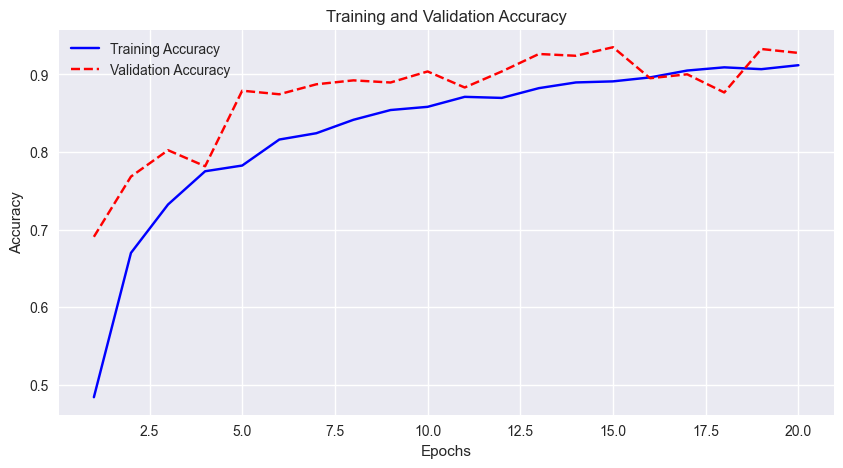
    
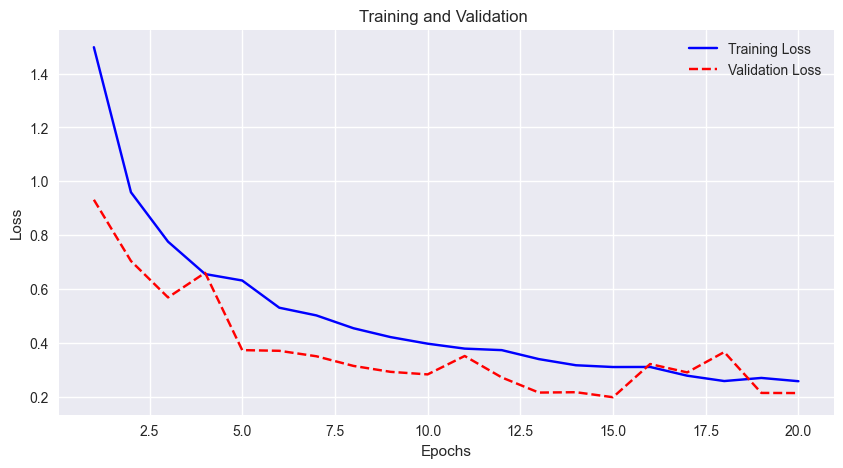

The model achieves 93% accuracy on the test set, with balanced performance across all classes, effectively distinguishing between tomato diseases and healthy leaves.

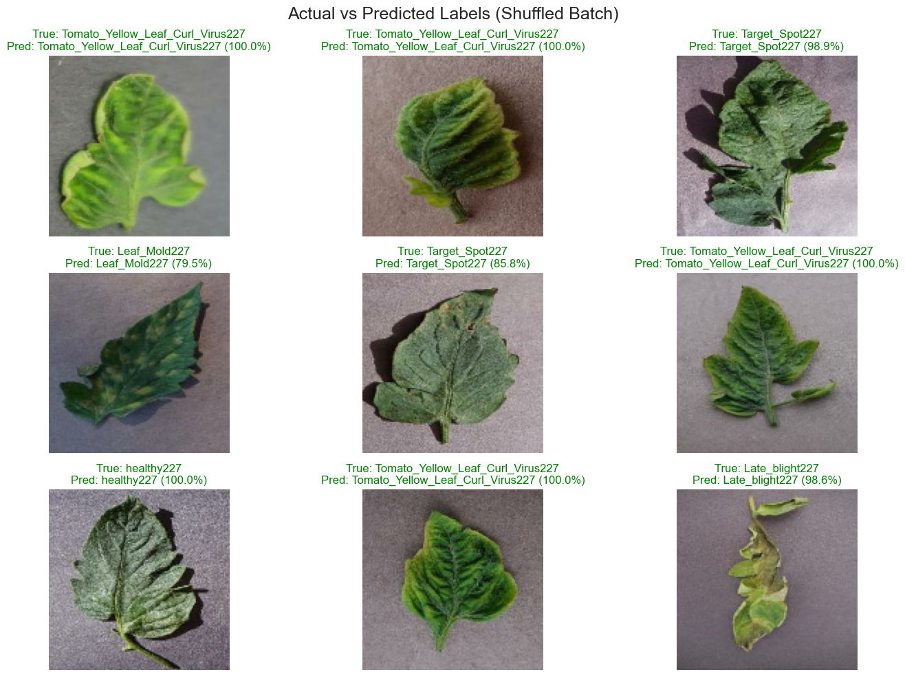
    
The first CNN model demonstrates strong and balanced performance in classifying tomato leaf diseases, achieving 91.2% training accuracy, 92.8% validation accuracy, and 93% test accuracy, with corresponding losses of 0.26, 0.21, and 0.21. Its three convolutional layers (32, 64, 128 filters), dropout (0.5), and data augmentation enable effective feature learning. The model generalizes well with no overfitting, providing a stable baseline, though recall for Early_blight and Target_Spot could be further improved through class balancing.

# 5.Model with Balanced class weights
- The steady decrease in validation loss from 1.35 to 0.21 confirms consistent generalization gains.

    [1m68/68[0m [32m━━━━━━━━━━━━━━━━━━━━[0m[37m[0m [1m6s[0m 70ms/step - accuracy: 0.9310 - loss: 0.2138
     Best Balanced Model Accuracy: 0.9310
  

    
- The balanced model showed strong validation performance, with validation accuracy surpassing training accuracy and validation loss decreasing steadily. This indicates improved generalization and reduced bias toward dominant classes after balancing the dataset
 
- The balanced model is more fair and generalizes better across all disease types, even though its overall accuracy is slightly lower. It’s better suited for real-world tomato disease detection, where missing rare diseases is more costly than a small drop in accuracy.

    
- The confidence percentage tells how sure the model was about its decision.
- High confidence but wrong shows overconfident misclassification.while ,Low confidence shows image may be confusing.

The class-balanced model reached 91% accuracy but improved recall for minority classes,Early_blight rose to 0.88, Bacterial_spot to 0.96,demonstrating better recognition of underrepresented classes. Overall, class weighting enhances minority class performance with minimal impact on overall accuracy.

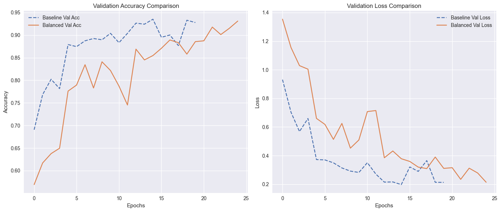

- The learning curves show that the baseline model achieved higher validation accuracy 0.90–0.93 and lower loss less than 0.3, indicating stronger generalization.
- The balanced model improved steadily, reaching about 0.91 accuracy by epoch 25, with smoother and more stable learning across minority classes, though with slightly lower overall accuracy.

- The unbalanced CNN achieved 93% test accuracy but underperformed on minority classes, with recall scores of 0.81 for Early_blight and 0.88 for Target_Spot. Applying class weighting improved minority class recognition—Early_blight rose to 0.88 and Bacterial_spot to 0.96—while maintaining overall accuracy.

- Next, class weighting will be combined with a lightweight transfer learning model, such as MobileNetV2, to further enhance both accuracy and balanced performance.

# 6.Transfer Learning with MobileNetV2
<pre style="white-space:pre;overflow-x:auto;line-height:normal;font-family:Menlo,'DejaVu Sans Mono',consolas,'Courier New',monospace">Model: "MobileNetV2_Transfer"
</pre>

<pre style="white-space:pre;overflow-x:auto;line-height:normal;font-family:Menlo,'DejaVu Sans Mono',consolas,'Courier New',monospace">┏━━━━━━━━━━━━━━━━━━━━━━━━━━━━━━━━━┳━━━━━━━━━━━━━━━━━━━━━━━━┳━━━━━━━━━━━━━━━┓
┃ Layer (type)                    ┃ Output Shape           ┃       Param # ┃
┡━━━━━━━━━━━━━━━━━━━━━━━━━━━━━━━━━╇━━━━━━━━━━━━━━━━━━━━━━━━╇━━━━━━━━━━━━━━━┩
│ input_layer_1 (InputLayer)      │ (None, 224, 224, 3)    │             0 │
├─────────────────────────────────┼────────────────────────┼───────────────┤
│ mobilenetv2_1.00_224            │ (None, 7, 7, 1280)     │     2,257,984 │
│ (Functional)                    │                        │               │
├─────────────────────────────────┼────────────────────────┼───────────────┤
│ global_average_pooling2d        │ (None, 1280)           │             0 │
│ (GlobalAveragePooling2D)        │                        │               │
├─────────────────────────────────┼────────────────────────┼───────────────┤
│ batch_normalization             │ (None, 1280)           │         5,120 │
│ (BatchNormalization)            │                        │               │
├─────────────────────────────────┼────────────────────────┼───────────────┤
│ dense (Dense)                   │ (None, 256)            │       327,936 │
├─────────────────────────────────┼────────────────────────┼───────────────┤
│ dropout (Dropout)               │ (None, 256)            │             0 │
├─────────────────────────────────┼────────────────────────┼───────────────┤
│ dense_1 (Dense)                 │ (None, 10)             │         2,570 │
└─────────────────────────────────┴────────────────────────┴───────────────┘
</pre>

<pre style="white-space:pre;overflow-x:auto;line-height:normal;font-family:Menlo,'DejaVu Sans Mono',consolas,'Courier New',monospace"> Total params: 2,593,610 (9.89 MB)
</pre>

<pre style="white-space:pre;overflow-x:auto;line-height:normal;font-family:Menlo,'DejaVu Sans Mono',consolas,'Courier New',monospace"> Trainable params: 333,066 (1.27 MB)
</pre>

<pre style="white-space:pre;overflow-x:auto;line-height:normal;font-family:Menlo,'DejaVu Sans Mono',consolas,'Courier New',monospace"> Non-trainable params: 2,260,544 (8.62 MB)
</pre>

    Epoch 1/25
    [1m318/318[0m [32m━━━━━━━━━━━━━━━━━━━━[0m[37m[0m [1m0s[0m 325ms/step - accuracy: 0.1121 - loss: 3.0625
    Epoch 1: val_accuracy improved from None to 0.23126, saving model to best_mobilenet_transfer.keras

    Epoch 25: val_accuracy improved from 0.86069 to 0.86345, saving model to best_mobilenet_transfer.keras
    [1m318/318[0m [32m━━━━━━━━━━━━━━━━━━━━[0m[37m[0m [1m131s[0m 413ms/step - accuracy: 0.8646 - loss: 0.4415 - val_accuracy: 0.8634 - val_loss: 0.4233 - learning_rate: 1.0000e-05
    
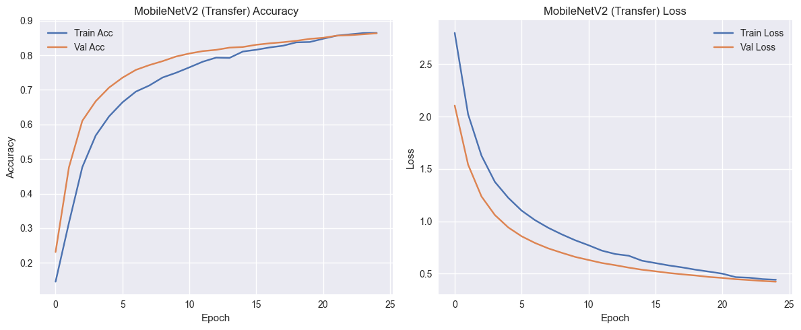
    
The MobileNetV2 model shows steady improvement, with both training and validation accuracy rising and loss consistently decreasing across epochs. The close alignment between training and validation curves indicates good generalization and minimal overfitting.

- Model Performance - The MobileNetV2 transfer model achieved 86% test accuracy with balanced precision and recall (macro F1 = 0.82). Smooth convergence and close train–validation curves indicate good generalization without overfitting.

- Class-Level Insights - Major classes like Tomato Yellow Leaf Curl Virus were classified with high confidence, while minority classes such as Early Blight showed lower recall. This indicates the model effectively leveraged pretrained ImageNet features but could benefit from more adaptation for underrepresented classes

- Recommendation & Next Step - Unfreeze and fine-tune the upper layers of MobileNetV2 using a lower learning rate and class weighting. This will improve feature learning, enhance distinction between similar disease categories, and boost both overall accuracy and balanced class performance.

# 7.Fine-Tuning (unfreeze top layers)

    Fine-tuning last 30 layers out of 154
    Epoch 1/30
    [1m318/318[0m [32m━━━━━━━━━━━━━━━━━━━━[0m[37m[0m [1m0s[0m 444ms/step - accuracy: 0.7388 - loss: 0.8496
    Epoch 1: val_accuracy improved from None to 0.72046, saving model to best_mobilenet_finetuned.keras
    [1m318/318[0m [32m━━━━━━━━━━━━━━━━━━━━[0m[37m[0m [1m177s[0m 538ms/step - accuracy: 0.7614 - loss: 0.7592 - val_accuracy: 0.7205 - val_loss: 0.9633 - learning_rate: 1.0000e-05

    Epoch 30: ReduceLROnPlateau reducing learning rate to 2.499999936844688e-06.
    [1m318/318[0m [32m━━━━━━━━━━━━━━━━━━━━[0m[37m[0m [1m183s[0m 577ms/step - accuracy: 1.0000 - loss: 0.0027 - val_accuracy: 0.9499 - val_loss: 0.1657 - learning_rate: 5.0000e-06
    

    [1m69/69[0m [32m━━━━━━━━━━━━━━━━━━━━[0m[37m[0m [1m23s[0m 333ms/step - accuracy: 0.9484 - loss: 0.1672
    Fine-tuned MobileNetV2 - Loss: 0.1672, Accuracy: 0.9484
    
- Training progress: The model started with 74% accuracy on epoch 1 and rapidly improved by the later epochs.
- Validation improvement: Validation accuracy steadily increased from 72%  95%, showing that fine-tuning the top layers significantly boosted performance.
- Learning rate adjustment: ReduceLROnPlateau reduced the LR from 1e-5 to 5e-6 toward the end, helping stabilize convergence.
- Generalization: The small gap between training and validation accuracy and smooth decline in validation loss indicate strong generalization with minimal overfitting.

- Overall Performance: The fine-tuned model achieved 95% test accuracy with a macro F1-score of 0.93 and a weighted F1-score of 0.95, showing strong improvements over the frozen model.
- Class-Level Insights: Major classes like Tomato Yellow Leaf Curl Virus (F1 0.99) and healthy leaves (F1 0.96) achieved near-perfect performance. Minority classes such as Early Blight (F1 0.84) and Target Spot (F1 0.88) improved significantly, though slightly lower than majority classes.
- Conclusion: Fine-tuning the top layers boosted both overall accuracy and minority class performance, demonstrating better feature adaptation for underrepresented disease categories.

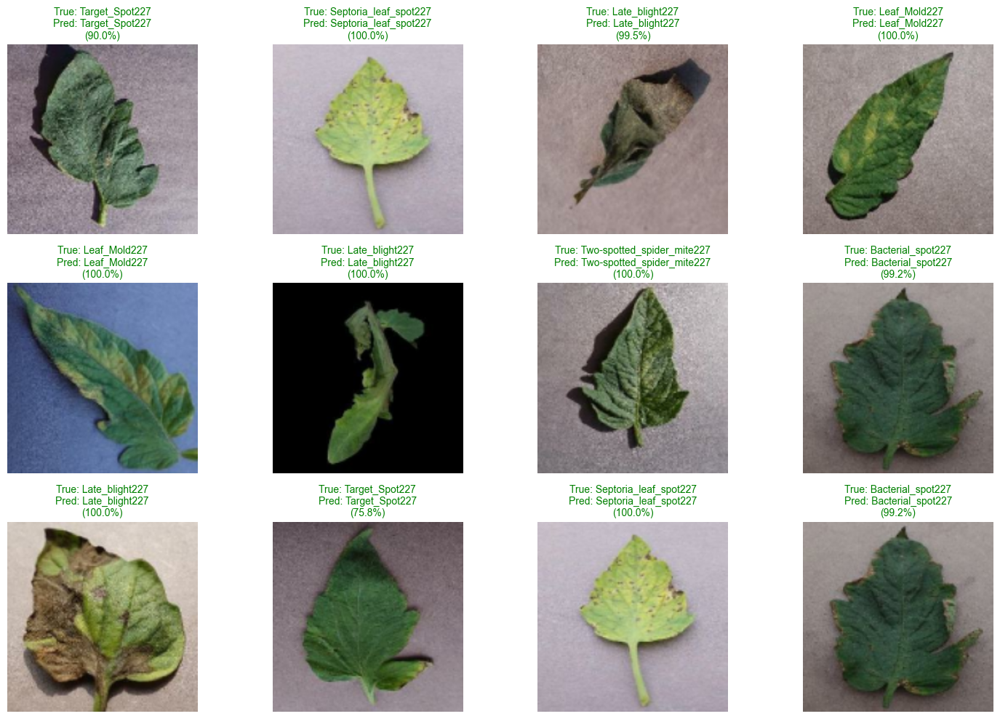
    
The model predicts most tomato diseases with high confidence and accuracy, with Target_Spot showing slightly lower confidence.

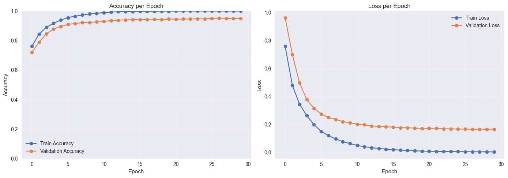
The learning curves show steady improvement and convergence.
Training and validation accuracy rise smoothly, stabilizing around 95%, while loss decreases consistently for both sets.
The close gap between training and validation curves indicates strong generalization and minimal overfitting, confirming that the fine-tuned MobileNet learned effectively and performs reliably on unseen  data.

# 7.Models Evaluation
    Best Model: MobileNet Fine-tuned with Accuracy = 0.9493
    
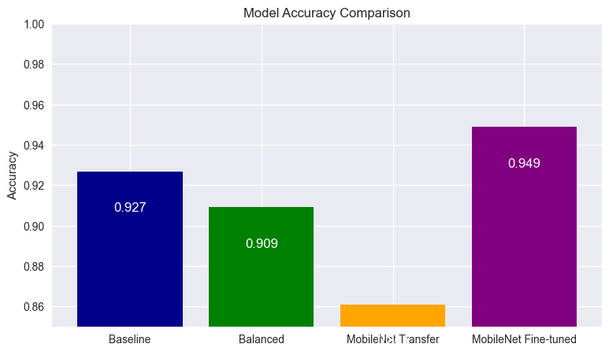

- The MobileNet Fine-tuned model shows the most accuracy.

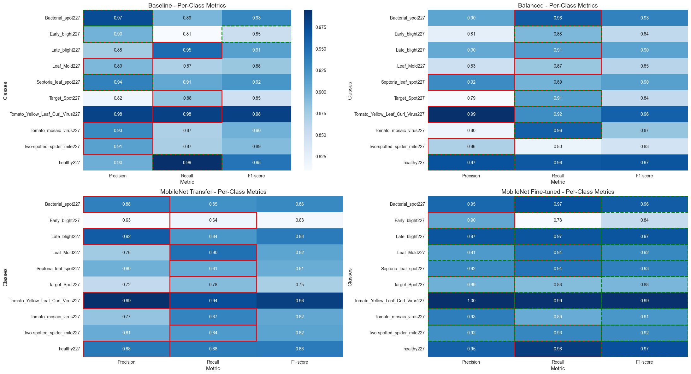
    
The fine-tuned MobileNet model achieved the best overall performance, with recall standing out as the most important metric for reliable disease detection. Its high recall (0.97–0.98) ensures nearly all diseased leaves are correctly identified, minimizing missed cases. This makes the fine-tuned model the most effective choice for tomato leaf disease detection.

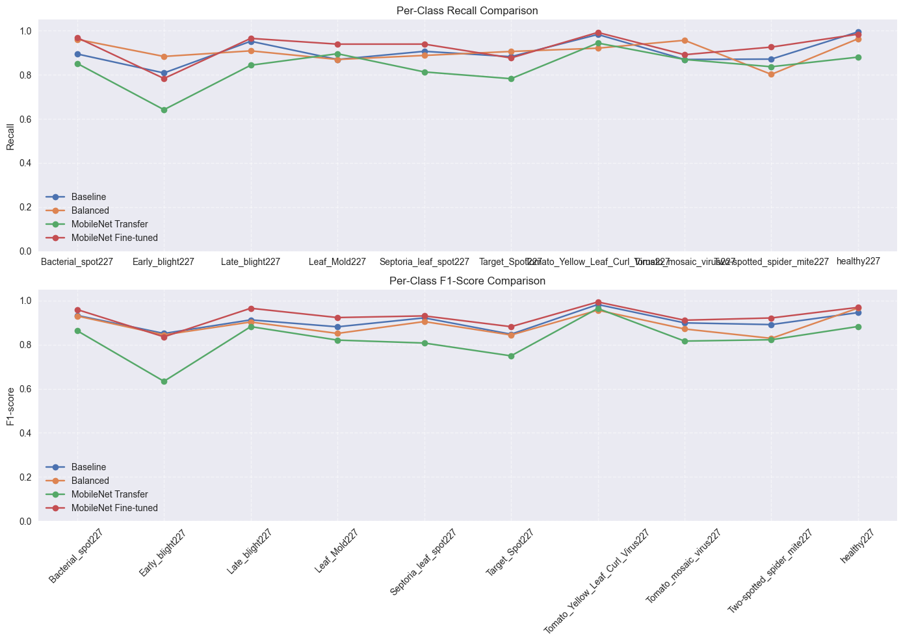
    
The fine-tuned MobileNet model achieved the highest and most consistent recall and F1-scores across all classes. It especially improved performance on challenging diseases like Early_blight227 and Two-spotted_spider_mite227. The frozen transfer model and class-balanced approach showed moderate gains but lagged behind. Overall, fine-tuning clearly enhanced the model’s adaptability and generalization to leaf disease features.

overall the bestmodel is MobileNet_fine_tunned

# Conclusion

The modeling workflow for tomato leaf disease classification was executed systematically, including data preprocessing, dataset balancing, and transfer learning with MobileNetV2. Initial frozen training provided a strong baseline with 86% test accuracy, while fine-tuning the top layers further improved overall performance to 95% test accuracy, demonstrating robust learning and generalization. Metrics such as precision, recall, and F1-score indicate reliable classification across both majority and minority classes

# Recommendations

1. Deployment: The fine-tuned MobileNetV2 model is ready for deployment in real-time disease detection systems, either on  mobile devices or cloud platforms.

2. Maintenance & Adaptation: Continuous monitoring and retraining with new data are recommended to preserve accuracy and adapt to changing disease patterns.

3. Future Enhancements: Further optimization, including exploring complementary architectures or ensembling strategies, may improve classification of challenging classes and strengthen overall robustness.

4. Resource Planning: For future modeling, use appropriately sized images, controlled batch sizes, and adequate GPU resources to prevent memory bottlenecks and ensure efficient training.
